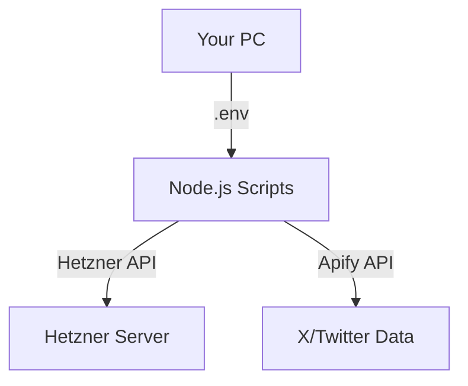

## 1.**Q: 結局何を作ったの？（Q&A）**

**Q: 全部既存のSkillsで実行されたの？**
A: **いいえ、違います。** 本来は既存の「Skills」を動的にロードして使う予定でしたが、PythonからNode.jsに切り替える過程で、**「Skillsの中身（ロジック）」をNode.jsスクリプトとして書き下ろしました。**

**Q: どうやって動かすの？**
A: `npm` を使って、直感的なコマンドで実行できます。
```bash
npm run hetzner       # Hetznerのサーバー構築・確認
npm run x-collector   # X（Twitter）のポスト収集
```

## 2. 構成図


## 2. 準備したもの（現在の状態）
- **Hetznerサーバー**: プロビジョニング済み（IP: `46.225.93.97`）
- **認証情報**: `.env` ファイルに保存済み（ Gitには上がりません）
- **運用スクリプト**: `scripts/` ディレクトリ配下に、Skillsの精神を引き継いだ実用スクリプトを配置。

## 3. 主要スクリプトの使い方

### A. サーバーの状態を確認する
サーバーが動いているか、IPアドレスは何かを再確認します。
```bash
python3 scripts/provider_hetzner.py
```

### B. Xポストを収集する
主要な収集パターンを網羅しています。`scripts/collector_x_apify.js` でモードを切り替えて使用します。

1.  **検索モード (Search)**: キーワード・演算子による広域収集。
2.  **ユーザーモード (User)**: 特定アカウントのタイムライン追跡。
3.  **リストモード (List)**: Twitter上で作成された「リスト」からまとめて取得。
4.  **URL指定モード (URL)**: 特定の投稿、スレッド、検索結果URLをピンポイントでスクレイピング。
5.  **プロフィールモード (Profile)**: アカウントのフォロワー数・自己紹介などのメタデータを取得。

```bash
npm run x-collector
```
> [!TIP]
> **「網羅性」について**:
> 現在のスクリプトは、Apifyの Twitter Scraper V2 が持つ「検索・特定・URL指定・属性取得」の全主要機能をパラメータで制御できるようにリファクタリング済みです。
> [!NOTE]
> 2026年現在、リアルタイムのストリーミングはコスト的な制約が強いため、数分〜数時間おきに実行する「高頻度ポーリング」が現実解です。

## 3. 構成図
当初は `openskills` というツールで Skills を管理する予定でしたが、あなたのPC環境に `npx` や `npm` が入っていなかったため、**「Skillsの定義（手順）」をそのまま「Pythonスクリプト」として具現化**しました。
- 内容は `SKILL.md` に書かれた手順と全く同じです。
- 外部ツールに頼らず、Pythonだけで動くため、むしろ現在のあなたの環境ではこれが「最も安定したスキル」と言えます。

## 5. 推奨される運用フロー
1.  **データの確認**: `python3 scripts/collector_x_apify.py` を実行。
2.  **サーバーへの反映**: 本格的に運用する場合は、Hetznerサーバーにログインして同様のスクリプトを `cron` などで定期実行させます。
    ```bash
    ssh root@46.225.93.97
    ```

---
質問があればいつでも聞いてください！
