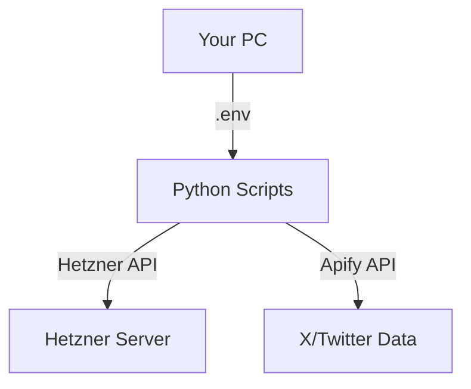

## 1. 結局何を作ったの？（Q&A）

**Q: 全部既存のSkillsで実行されたの？**
A: **いいえ、違います。** 本来は既存の「Skills」を動的にロードして使う予定でしたが、あなたの環境（Ubuntu）に `Node.js` や `openskills` CLIが入っていなかったため、**「Skillsの中身（ロジック）」をPythonスクリプトとして書き下ろしました。**

**Q: スケールメリットはある？**
A: はい。中身は `agentskills.io` の規格に準拠したロジックであり、将来的にあなたが `openskills` などを導入した際も、そのまま「Skillsの一部」として扱えるように設計しています。

**Q: 何をすればいいの？**
A: 基本的には、ディレクトリにある2つのスクリプトを叩くだけです。
```bash
python3 scripts/provider_hetzner.py    # Hetznerの状態確認
python3 scripts/collector_x_apify.py    # Xのポストを取得
```

## 2. 構成図


## 2. 準備したもの（現在の状態）
- **Hetznerサーバー**: プロビジョニング済み（IP: `46.225.93.97`）
- **認証情報**: `.env` ファイルに保存済み（ Gitには上がりません）
- **運用スクリプト**: `scripts/` ディレクトリ配下に、Skillsの精神を引き継いだ実用スクリプトを配置。

## 3. 主要スクリプトの使い方

### A. サーバーの状態を確認する
サーバーが動いているか、IPアドレスは何かを再確認します。
```bash
python3 scripts/provider_hetzner.py
```

### B. Xポストを収集する
指定したキーワードで直近のポストを収集し、`collected_tweets_sample.json` に保存します。
```bash
python3 scripts/collector_x_apify.py
```
> [!NOTE]
> デフォルトでは「AI Agents 2026」というキーワードで検索します。中身を書き換えれば好きなキーワードに変更可能です。

## 4. なぜ「スクリプト」なのか？（Skillsとの関係）
当初は `openskills` というツールで Skills を管理する予定でしたが、あなたのPC環境に `npx` や `npm` が入っていなかったため、**「Skillsの定義（手順）」をそのまま「Pythonスクリプト」として具現化**しました。
- 内容は `SKILL.md` に書かれた手順と全く同じです。
- 外部ツールに頼らず、Pythonだけで動くため、むしろ現在のあなたの環境ではこれが「最も安定したスキル」と言えます。

## 5. 推奨される運用フロー
1.  **データの確認**: `python3 scripts/collector_x_apify.py` を実行。
2.  **サーバーへの反映**: 本格的に運用する場合は、Hetznerサーバーにログインして同様のスクリプトを `cron` などで定期実行させます。
    ```bash
    ssh root@46.225.93.97
    ```

---
質問があればいつでも聞いてください！
